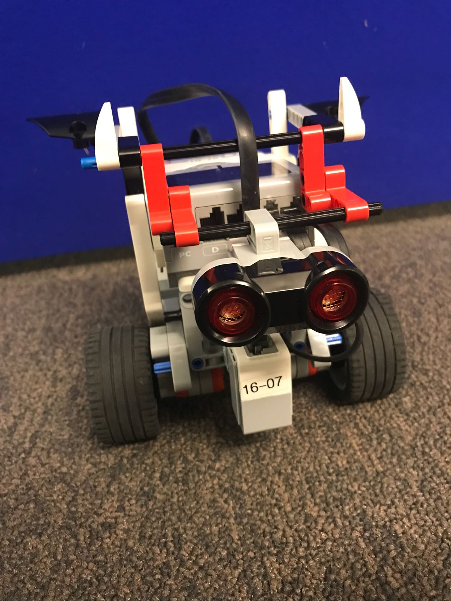

# My Robot: Chip

LEGO EV3 Mindstorms 부품을 사용하여 로봇을 만들고, Java를 프로그래밍을 통해 로봇이 환경 내에서 작동하고 상호 작용할 수 있도록 설계한 프로젝트입니다. 시각적 센서를 활용한 총 4개의 테스트가 로봇에게 주어졌으며 Chip은 모든 테스트를 성공적으로 수행하였습니다. 이 프로젝트에서는 로봇의 생태학적 틈새(ecological niche)를 설명하고 디자인 선택과 다양한 문제에서 파생된 문제에 대한 솔루션을 설명합니다. 결과적으로 로봇의 성능과 일반적인 경험에 대한 결론을 얻을 수 있습니다.

이 프로젝트는 Eclipse IDE에서 Java을 이용하여 진행되었으며, 자세한 구현 방법 및 결과는 다음과 같은 추가 코드 파일 및 리포트에서 확인하실 수 있습니다.  
- [(해당 연구에 대한 code 보러가기)](/code)  
- [(해당 연구에 대한 full report 보러가기)](report.pdf)   

## Design

### Basic robot design

[가이드라인](https://le-www-live-s.legocdn.com/sc/media/lessons/mindstorms-ev3/building-instructions/ev3-rem-driving-base-79bebfc16bd491186ea9c9069842155e.pdf)을 참조하여 LEGO EV3 Mindstorms 부품으로 기본적인 로봇을 설계하였습니다. 이 디자인은 대부분의 무게가 로봇 뒤쪽에 있기 때문에 매우 안정적입니다. 이후, 컬러 센서와 그리퍼, 자이로스코프의 부착이 가능하도록 구조를 조정하였습니다. 추가적으로, 질량 중심을 더 뒤쪽으로 보내 로봇이 경사면에 있을 때 더 높은 안정성을 갖게하기 위하여 뒤쪽에 구조를 추가하였습니다. 

다음은 그리퍼를 사용하지 않는 챌린지에서 기동성을 위해 그리퍼를 뗀 chip 모델 입니다: 
  

### Algorithm design

Line following 알고리즘과 Friend or Foe 알고리즘을 제작하였습니다. 자세한 구현 방법은 [full report](report.pdf)를 참조 바랍니다.

### Challenge goal design

과제는 각각 다른 목표를 가진 4개의 작업으로 구성됩니다. 첫 번째 과제의 목적은 로봇이 배치된 환경에서 로봇의 방향을 지정하기 위해 서로 다른 센서의 사용을 결합하는 것입니다. 두 번째 과제는 적절한 속도를 유지하면서 PID 컨트롤러를 가능한 한 매끄럽게 만드는 것이었습니다. 이 도전의 또 다른 목표는 경사면을 오르내릴 수 있는 방식으로 로봇을 설계하는 것이었습니다. 세 번째 과제에서는 색상 인식, 물체 감지 및 행동 표시가 중요한 역할을 했습니다. 챌린지 4의 목표는 로봇이 색상 인식 및 물체 감지에 따라 경로를 선택하고 따르도록 하고 그리퍼를 사용하여 주어진 위치에서 물체를 현지화, 잡고 떨어뜨리는 것이었습니다.

## Challenges

### 1. Explore your island 
챌린지 1의 환경은 그리드, 미로 및 두 개의 기둥으로 구성됩니다. 그리드는 가운데에 십자가 형태로 4분할이 된 정사각형으로 검정색 배경에 흰색 선으로 구성되어 있습니다. 그리드에는 각 모서리와 중앙에 총 5개의 체크포인트가 있습니다. 이 작업에서 가장 중요한 측면은 라인을 얼마나 잘 따라가느냐이기 때문에, 아래 표면의 광도를 감지하기 위해 컬러 센서를 사용합니다. 추가로, 자이로스코프를 사용하여 얼마나 많은 모서리를 통과했는지 감지하여, 그리드에서 이미 방문한 지점에 대한 지식을 저장합니다.   
로봇이 수행해야 할 작업은 다음과 같습니다:  
- 그리드의 모든 체크포인트를 방문한 후 첫 번째 기둥으로 가서 반응합니다.   
- 다음, 미로의 라인을 따라 2개의 체크포인트를 거쳐 두 번째 기둥에 도달하여 반응합니다. 
  

``{Task = line following, Robot = hasColorSensor, Environment = Grid}`` 
``{Task = counting corners, Robot = hasGyroscope, Environment = Grid}`` 
``{Task = going to the other side of the line , Robot = hasColorSensor, Environment = white line}`` 
``{Task = findObject, Robot = hasUltrasonicSensor , Environment = middle of the grid, pillar}`` 
``{Task = reactToPillar Robot = hasUltrasonicSensor , Environment = Pillar}`` 
``{Task = solveMaze, Robot = hasColorSensor, Environment = Maze}`` 

### 2. Run for your life 

챌린지 2에서 로봇은 라인을 따라 부드럽게 여러 장애물을 건너야 합니다. 특히 경사면과 같은 장애물은 로봇 설계에 영향을 주는 주요 요인입니다.
  

``{Task = line following, Robot = hasColorSensor, Environment = bridge}`` 
``{Task = line following, Robot = hasColorSensor, Environment = seesaw}`` 
``{Task = cross bridge, Robot = weight, Environment = bridge}`` 
``{Task = cross seesaw, Robot = weight, Environment = seesaw}`` 
``{Task = cross bridge, Robot = hasWheelAtBack, Environment = bridge}``  
``{Task = cross seesaw, Robot = hasWheelAtBack, Environment = seesaw}`` 

#### >> 작업 영상 

### 3. Friend or Foe 

챌린지 3에서는 친구(friend)와 적(foe)을 나타내는 기둥이 공존하는 필드에 로봇이 배치됩니다. 로봇은 필드 밖으로 나가지 않아야 하며, 기둥을 감지하여 아군인지 적군인지 판단하고 이에 대해 반응해야 합니다. 아군인 경우와 적군인 경우 각각에 해당하는 노래가 나오도록 설계하여, 두 반응의 명확한 차이점을 관찰할 수 있도록 하였습니다. 만약 적이 탐지되면 로봇은 적을 제거하기위해 공격적인 행동을 택합니다.  

``{Task = findObject, Robot = hasUltrasonicSensor , Environment = field with pillars}`` 
``{Task = stayInsideField, Robot = hasColorSensor , Environment = field with white outer lines}``  
``{Task = reactToPillar, Robot = hasSpeaker, Environment = field with pillars}`` 
``{Task = detectColor, Robot = hasColorSensor, Environment = pillar with colored circle}`` 

#### >> 작업 영상 
 

### 4. Search & Rescue 

챌린지 4에서 로봇은 좁은 다리를 거쳐 한쪽 섬에서 반대쪽 섬으로 이동해야 합니다. 반대쪽 섬에 도착하면 기둥을 감지하고 기둥의 색에 따라 오른쪽과 왼쪽 중 주행 방향을 결정합니다. 파란색 기둥의 경우 왼쪽으로 주행해야 하며, 빨간색인 경우는 오른쪽으로 향해야 합니다. 이동한 라인의 끝에서 먹이를 감지하면 그리퍼를 사용하여 이를 집어올리고, 다시 다리를 따라 처음의 섬으로 돌아가 이를 내려놓아야 합니다. 로봇이 다시 돌아가서 추가로 먹이를 얻는 것 또한 가능합니다.  

``{Task = go to narrow passage, hasGyroscope, Robot = hasColorSensor , Environment = field with white outer lines}`` 
``{Task = line following, Robot = hasColorSensor, hasGyroscope, Environment = white line on bridge and ground }`` 
``{Task = detect colour healthy food, Robot = hasColorSensor, hasUltraSonicSensor, Environment = pillar with colored circle from close distance of splitting made of a white line}`` 
``{Task = walk to healthy food, Robot = hasColorSensor, Environment = white line}`` 
``{Task = pick up food, Robot = hasUltraSonicSensor, hasAGripper, Environment = end of white line and an object}`` 
``{Task = drop of food, Robot = hasUltraSonicSensor, hasAGripper, hasColorSensor Environment = pillar on field with white outer lines}`` 

#### >> 작업 영상 

|||

## Result

Chip은 모든 챌린지에 대해 속도 및 과제 수행 모두에서 안정성을 띠며 높은 점수를 가져왔습니다. 더 자세한 결과 및 고찰은 [full report](report.pdf)를 참조 바랍니다.

